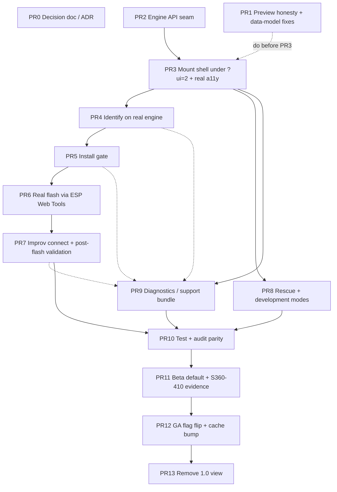

# WebFlash 2.0 Migration: Delivery Plan

Companion to `docs/webflash-2-migration.md`. That document defines *what* to
build. This one defines *how to ship it*: the delivery method, the dependency
graph, the per-PR mechanics, and the go-live.

---

## 1. Method decision

**Many small PRs, trunk-based, every binding gated behind `?ui=2`. Not one
large PR, and not a long-lived integration branch.**

The defining property: 1.0 stays the default until the very last step, so
`main` is releasable after every single merge. There is never a half-migrated
production state. The cutover is a one-line default change that ships through the
normal GitHub Pages deploy. A user can return to the 1.0 view immediately via
`?ui=1`, but rolling back the site default is a git revert of the cutover commit
plus the Pages rebuild it triggers, not a flag flip, because GitHub Pages serves
a static default with no remotely mutable flag.

### Alternatives considered

* **Single PR.** Rejected. The diff would touch the entire trust model at once.
  The repo's safety mechanism is per-PR review (the Codex bot runs on each PR,
  and it already caught two real defects on #477). A monolith gets shallow
  review and couples unrelated subsystems, so one bug in the Improv binding
  blocks the provenance binding. The value of this repo is an auditable gate;
  shipping it in one unreviewable lump defeats the point.
* **Long-lived `webflash-2-integration` branch, merged once at the end.**
  Rejected as the primary method. It buys isolation we already have for free,
  because 1.0 and 2.0 are flag-separated at the same origin. It also drifts from
  `main`, delays integration feedback, and turns the cutover into one giant
  merge. Keep it only as a fallback if `main` starts churning heavily during the
  binding chain.
* **Rewrite the 1.0 view in place.** Rejected. There is no safe intermediate
  state, and no flag to roll back to.

### When a single PR is acceptable here

Only for the trivially combinable preview fixes (PR 1 below). Never for the
engine-binding chain.

### When stacked PRs help

The binding spine (PR 4 to PR 7) is strictly sequential. If `main` churns under
you during that stretch, stack those four on each other rather than rebasing
each on a moving `main`. Track A (PR 1) and the side branches (PR 8, PR 9) stay
independent either way.

---

## 2. Dependency graph

* **Critical path (the spine):** PR 2, 3, 4, 5, 6, 7, 10, 11, 12, 13.
* **Independent, ship first:** PR 1 (preview honesty) and PR 0 (decision). No
  engine dependency.
* **Parallel side branches off PR 3:** PR 8 (rescue) and PR 9 (diagnostics
  scaffold) can run alongside the 4 to 7 chain. PR 9 is fully wired only once
  4, 5, and 7 land, so scaffold it early and fill it in.

---

## 3. Per-PR mechanics

Branch slugs are illustrative. Your agentic sessions will generate the actual
`claude/...` branch names; what matters is the base and the flag state. Default
UI stays `ui=1` (1.0) for every PR until PR 12.

| PR | Slug | Base | Default UI after merge | `main` releasable after merge | Revert |
| --- | --- | --- | --- | --- | --- |
| 0 | `wf2-00-decision-doc` | main | ui=1 | Yes (docs only) | Revert commit |
| 1 | `wf2-01-preview-honesty` | main | ui=1 | Yes (preview only) | Revert commit |
| 2 | `wf2-02-engine-seam` | main | ui=1 | Yes (refactor, no UI change) | Revert commit |
| 3 | `wf2-03-mount-shell` | main (after 2) | ui=1 | Yes (2.0 reachable only via `?ui=2`) | Revert commit |
| 4 | `wf2-04-identify` | main (after 3) | ui=1 | Yes (behind flag) | Revert commit |
| 5 | `wf2-05-install-gate` | main (after 4) | ui=1 | Yes (behind flag) | Revert commit |
| 6 | `wf2-06-real-flash` | main (after 5) | ui=1 | Yes (behind flag) | Revert commit |
| 7 | `wf2-07-improv-postflash` | main (after 6) | ui=1 | Yes (behind flag) | Revert commit |
| 8 | `wf2-08-rescue-dev` | main (after 3) | ui=1 | Yes (behind flag) | Revert commit |
| 9 | `wf2-09-diagnostics` | main (after 3) | ui=1 | Yes (behind flag) | Revert commit |
| 10 | `wf2-10-test-parity` | main (after 7,8,9) | ui=1 | Yes (tests only) | Revert commit |
| 11 | `wf2-11-beta-default` | main (after 10) | ui=1 (prod) / ui=2 (beta) | Yes (beta only) | Revert commit |
| 12 | `wf2-12-ga-cutover` | main (after 11) | **ui=2** (ui=1 fallback) | Yes (revert restores the ui=1 default) | Revert commit + Pages rebuild |
| 13 | `wf2-13-remove-1.0-view` | main (after 12, one clean release) | ui=2 (no fallback) | Yes (single view) | Revert commit |

The "revert" column is the point of the method. Up to PR 11, every revert is a
plain commit revert with zero production impact, because production is still on
1.0. At PR 12, a user returns to the 1.0 view immediately via `?ui=1`, but
rolling back the site default is a git revert of the cutover commit plus the
GitHub Pages rebuild it triggers, not a flag flip, because GitHub Pages serves a
static default with no remotely mutable flag.

---

## 4. Session batching

Each agentic session typically produces one PR. Group them so dependent work
lands together and the reviewer sees coherent units:

1. **Session 1.** PR 0 + PR 1. Decision doc plus the preview honesty and
   data-model fixes. Ships the same day, removes the false signature copy and
   the TRIAC and preview-flag defects from `main`.
2. **Session 2.** PR 2 + PR 3. The engine seam and the flag-gated shell mount
   with real accessibility. This is the pivot: after it, the 2.0 view can import
   the real engine.
3. **Session 3.** PR 4. Identify on the real engine (kits, conflicts, lookup,
   installability, share links).
4. **Session 4.** PR 5 + PR 6. The install gate and real flashing. Keep these
   together: the gate must pass before a real flash is allowed, so they are
   tested as a pair.
5. **Session 5.** PR 7, plus PR 8 and PR 9 if time allows (or split PR 8/PR 9
   into a parallel session since they hang off PR 3, not the spine).
6. **Session 6.** PR 10, then PR 11, then PR 12. Tests green, beta dogfood with
   real S360-410 PoE flash evidence, then the GA flag flip. PR 13 follows after
   one clean stable release.

---

## 5. Go-live and rollback

* **Flag:** a single URL parameter and a default constant. `?ui=2` opts in
  during PR 3 to PR 11. PR 12 flips the default constant to 2.0 and keeps
  `?ui=1` as the opt-out fallback for one release. PR 13 removes the constant
  and the fallback.
* **Same origin throughout.** The 2.0 view always renders inside the production
  shell, so it inherits the CSP, the service worker, the manifest, and the
  headers. Never a separate site.
* **Cache:** PR 12 bumps `CACHE_NAME` so the service worker serves the new shell.
  The plan originally named `webflash-v5`, but the WF-UX and bundle-picker work
  churned the live cache to `webflash-v13` and PR 11's beta-default work took
  `webflash-v14`, so the cutover lands at `webflash-v15` (the next monotonic bump;
  an existing test already requires the name to be past `webflash-v5`). PR 12 also
  flips the default inside `scripts/ui-version.js`, a tokenless module that
  re-primes by riding this cache-name bump. The existing `activate` purge removes
  the old `webflash-` cache. Verify the update banner and manifest freshness still
  gate after the bump.
* **Rollback ladder:** before GA, revert the offending PR and production is
  unaffected because the default is still `ui=1`. At and after GA, a user returns
  to the 1.0 view immediately via `?ui=1`, but rolling back the site default is a
  git revert of the cutover commit plus the GitHub Pages rebuild it triggers, not
  a flag flip, because GitHub Pages serves a static default with no remotely
  mutable flag. A true no-deploy default toggle would require a runtime flag
  source and likely a different host and is out of scope.

---

## 6. Delivery guardrails

These bind the *how*, on top of the GA acceptance gates in the strategy doc:

* Do not merge any binding PR (4 to 9) that weakens a gate. If the 2.0 view
  cannot yet enforce a blocking provenance check, a channel acknowledgement, or
  the freshness matrix, that PR is not ready to merge even behind the flag,
  because PR 11 dogfood and PR 12 GA inherit whatever shipped.
* Keep `ui=1` the default through PR 11. The flip is PR 12 and nothing earlier.
* PR 11 does not pass without clean S360-410 PoE flash evidence. It is the
  master shipping gate and it applies to the 2.0 cutover unchanged.
* PR 13 does not start until PR 12 has been live for one stable release with no
  regression reports. The 1.0 view is the rollback target until then.
